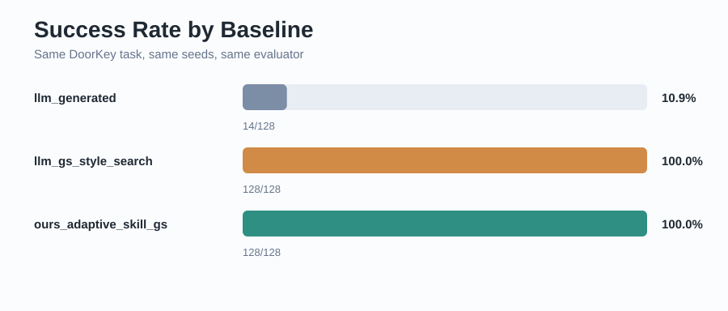
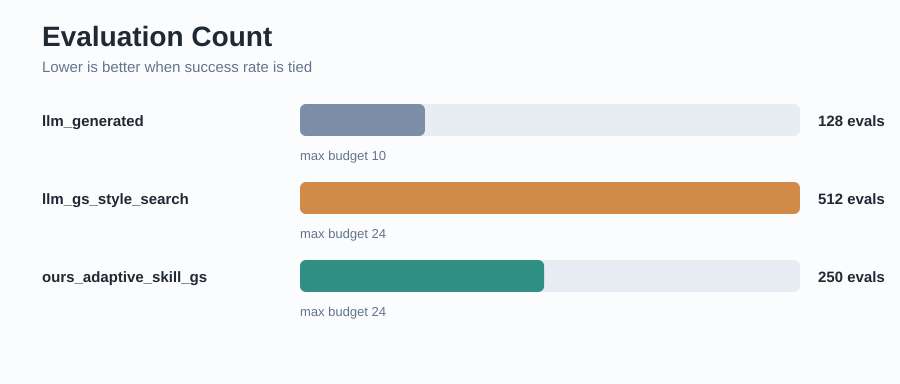
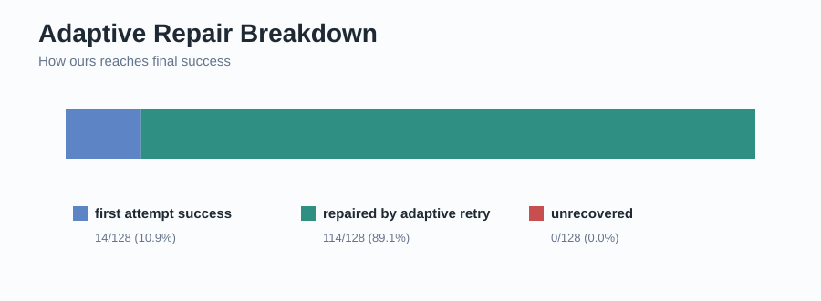

# Skill-GS Demo Evidence Pack

日期：2026-08-22

## 核心訊息

這份 demo pack 將 Skill-GS 目前最重要的實驗結果整理成可展示版本：

- `llm_generated` one-shot proxy：不做 search、不做 repair。
- `llm_gs_style_search` proxy：用多個 candidate 做完整搜尋。
- `ours_adaptive_skill_gs`：用 failure attribution、replanning、memory 與 retry budget schedule 做 adaptive repair。

在 DoorKey seeds 0..127 的 local proxy comparison 中，ours 與 candidate search 都達到 128/128，但 ours 使用較少 evaluation 次數。

## 實驗設定

| Setting | Value |
|---|---|
| Task | DoorKey |
| Seeds | 0..127 |
| Max allowed execution budget | 24 |
| External LLM calls | false |

## 圖表







## 結果表

| Group | Successes | Success Rate | Evaluation Count | Max Budget | Repair | Memory |
|---|---:|---:|---:|---:|---|---|
| `llm_generated` | 14/128 | 0.109375 | 128 | 10 | no | no |
| `llm_gs_style_search` | 128/128 | 1.000000 | 512 | 24 | no | no |
| `ours_adaptive_skill_gs` | 128/128 | 1.000000 | 250 | 24 | yes | yes |

## 解讀

- One-shot proxy 只成功 14/128，顯示低 budget 固定策略不足以穩定完成 DoorKey。
- LLM-GS-style search proxy 達到 128/128，但需要 512 次 evaluation。
- Ours 達到 128/128，只需要 250 次 evaluation，比 search proxy 少 262 次。
- 目前 failure attribution 指向 insufficient budget，而不是 not best skill。

## Demo 指令

```powershell
python scripts\skill_gs\run_baseline_comparison.py --seed-start 0 --seed-end 127 --initial-max-steps 10 --search-candidate-max-steps 10 20 22 24 --ours-retry-budget-schedule 20 22 24 --ours-max-attempts 4 --perturbation-seed 123 --output output\skill_gs\baseline_comparison_seed0_127.json
python scripts\skill_gs\generate_evidence_pack.py --baseline-json output\skill_gs\baseline_comparison_seed0_127.json
```

## 限制

這裡的 LLM-named baselines 是 reproducible local proxy，尚未接真正外部 LLM API。這讓展示更穩定，但不能直接宣稱已完整重現 paper 的 LLM-GS 搜尋結果。
